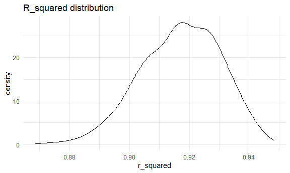

HW 6
================
Christina Dai

# Problem 2

### Importing weather data:

``` r
weather_df = 
  rnoaa::meteo_pull_monitors(
    c("USW00094728"),
    var = c("PRCP", "TMIN", "TMAX"), 
    date_min = "2022-01-01",
    date_max = "2022-12-31") |>
  mutate(
    name = recode(id, USW00094728 = "CentralPark_NY"),
    tmin = tmin / 10,
    tmax = tmax / 10) |>
  select(name, id, everything())
```

    ## using cached file: C:\Users\chris\AppData\Local/R/cache/R/rnoaa/noaa_ghcnd/USW00094728.dly

    ## date created (size, mb): 2023-09-29 16:29:56.581161 (8.542)

    ## file min/max dates: 1869-01-01 / 2023-09-30

### Bootstrapping 5000 samples from the dataset and producting estimates of r^2 and log(beta1 \* beta2):

``` r
weather_boot_results = 
  weather_df %>% 
    bootstrap(5000, id = "strap_number") %>% 
    mutate(
      models = map(strap, ~lm(tmax ~ tmin + prcp, data = .x)),
      results_r2 = map(models, broom::glance),
      results_logb1b2 = map(models, broom::tidy)
    ) %>% 
    unnest(results_r2) %>% 
    janitor::clean_names() %>% 
    select(strap_number, r_squared, results_logb1b2) %>% 
    unnest(results_logb1b2) %>% 
    janitor::clean_names() %>% 
    select(strap_number:estimate) %>% 
    pivot_wider(
      names_from = term,
      values_from = estimate
    ) %>% 
    mutate(log_b1b2 = log(tmin * prcp)) %>% 
    select(-`(Intercept)`)
```

    ## Warning: There was 1 warning in `mutate()`.
    ## ℹ In argument: `log_b1b2 = log(tmin * prcp)`.
    ## Caused by warning in `log()`:
    ## ! NaNs produced

### Plotting the estimates:

R_squared distribution

``` r
weather_boot_results %>% 
  ggplot(aes(x = r_squared)) + 
  geom_density() +
  labs(title = "R_squared distribution")
```



This distribution shows a left skew with a slight tail on the lower end
of the distribution, from around 0.89 and below. Most of the values are
concentrated between 0.90 and 0.94.

Log(beta_1 \* beta_2) distribution

``` r
weather_boot_results %>% 
  ggplot(aes(x = log_b1b2)) + 
  geom_density() +
  labs(title = "log(beta_1 * beta2) distribution")
```

    ## Warning: Removed 3361 rows containing non-finite values (`stat_density()`).


This distribution is heavily left-skewed, with a long tail from about
-13 to around -6.5, when it evens out more. The most values are
concentrated around -6.5 to -5.

### 95% confidence intervals for both estimates

``` r
weather_boot_results %>% 
  pivot_longer(
    cols = c(r_squared, log_b1b2),
    names_to = "estimate_type",
    values_to = "estimate"
  ) %>% 
  na.omit() %>% 
  group_by(estimate_type) %>% 
  summarize(
    ci_lower = quantile(estimate, 0.025),
    ci_upper = quantile(estimate, 0.975)
  )
```

    ## # A tibble: 2 × 3
    ##   estimate_type ci_lower ci_upper
    ##   <chr>            <dbl>    <dbl>
    ## 1 log_b1b2        -8.98    -4.60 
    ## 2 r_squared        0.889    0.941

The 95% CI for the r_squared estimates is (0.889, 0.940). The 95% CI for
the log(beta_1 \* beta_2) is (-9.21, -4.58). This aligns with the plots.
