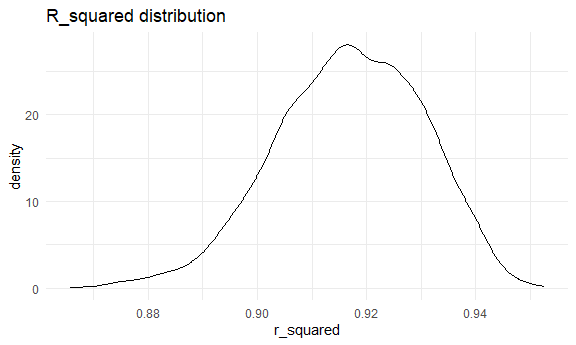
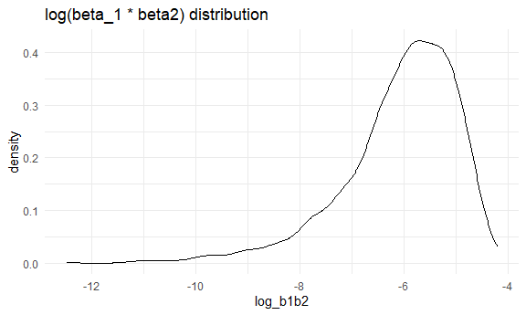
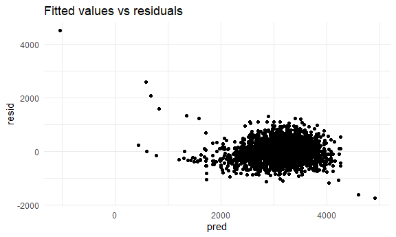
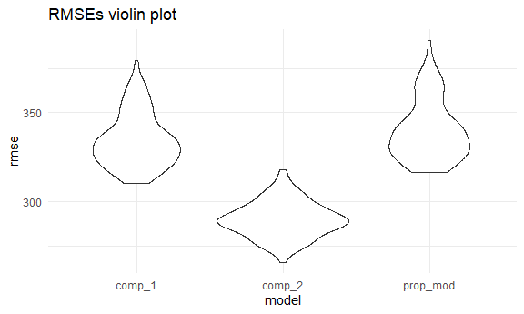

HW 6
================
Christina Dai

# Problem 2

### Importing weather data:

``` r
weather_df = 
  rnoaa::meteo_pull_monitors(
    c("USW00094728"),
    var = c("PRCP", "TMIN", "TMAX"), 
    date_min = "2022-01-01",
    date_max = "2022-12-31") |>
  mutate(
    name = recode(id, USW00094728 = "CentralPark_NY"),
    tmin = tmin / 10,
    tmax = tmax / 10) |>
  select(name, id, everything())
```

    ## using cached file: C:\Users\chris\AppData\Local/R/cache/R/rnoaa/noaa_ghcnd/USW00094728.dly

    ## date created (size, mb): 2023-09-29 16:29:56.581161 (8.542)

    ## file min/max dates: 1869-01-01 / 2023-09-30

### Bootstrapping 5000 samples from the dataset and producting estimates of r^2 and log(beta1 \* beta2):

``` r
weather_boot_results = 
  weather_df %>% 
    bootstrap(5000, id = "strap_number") %>% 
    mutate(
      models = map(strap, ~lm(tmax ~ tmin + prcp, data = .x)),
      results_r2 = map(models, broom::glance),
      results_logb1b2 = map(models, broom::tidy)
    ) %>% 
    unnest(results_r2) %>% 
    janitor::clean_names() %>% 
    select(strap_number, r_squared, results_logb1b2) %>% 
    unnest(results_logb1b2) %>% 
    janitor::clean_names() %>% 
    select(strap_number:estimate) %>% 
    pivot_wider(
      names_from = term,
      values_from = estimate
    ) %>% 
    mutate(log_b1b2 = log(tmin * prcp)) %>% 
    select(-`(Intercept)`)
```

    ## Warning: There was 1 warning in `mutate()`.
    ## ℹ In argument: `log_b1b2 = log(tmin * prcp)`.
    ## Caused by warning in `log()`:
    ## ! NaNs produced

### Plotting the estimates:

R_squared distribution

``` r
weather_boot_results %>% 
  ggplot(aes(x = r_squared)) + 
  geom_density() +
  labs(title = "R_squared distribution")
```



This distribution shows a left skew with a slight tail on the lower end
of the distribution, from around 0.89 and below. Most of the values are
concentrated between 0.90 and 0.94.

Log(beta_1 \* beta_2) distribution

``` r
weather_boot_results %>% 
  ggplot(aes(x = log_b1b2)) + 
  geom_density() +
  labs(title = "log(beta_1 * beta2) distribution")
```

    ## Warning: Removed 3361 rows containing non-finite values (`stat_density()`).



This distribution is heavily left-skewed, with a long tail from about
-13 to around -6.5, when it evens out more. The most values are
concentrated around -6.5 to -5.

### 95% confidence intervals for both estimates

``` r
weather_boot_results %>% 
  pivot_longer(
    cols = c(r_squared, log_b1b2),
    names_to = "estimate_type",
    values_to = "estimate"
  ) %>% 
  na.omit() %>% 
  group_by(estimate_type) %>% 
  summarize(
    ci_lower = quantile(estimate, 0.025),
    ci_upper = quantile(estimate, 0.975)
  )
```

    ## # A tibble: 2 × 3
    ##   estimate_type ci_lower ci_upper
    ##   <chr>            <dbl>    <dbl>
    ## 1 log_b1b2        -8.98    -4.60 
    ## 2 r_squared        0.889    0.941

The 95% CI for the r_squared estimates is (0.889, 0.940). The 95% CI for
the log(beta_1 \* beta_2) is (-9.21, -4.58). This aligns with the plots.

# Problem 3

### Loading data and cleaning it:

``` r
birthweight_df = 
  read_csv("./data/birthweight.csv") %>% 
  mutate(
    babysex = as_factor(babysex),
    frace = as_factor(frace),
    malform = as_factor(malform),
    mrace = as_factor(mrace),
    )
```

    ## Rows: 4342 Columns: 20
    ## ── Column specification ────────────────────────────────────────────────────────
    ## Delimiter: ","
    ## dbl (20): babysex, bhead, blength, bwt, delwt, fincome, frace, gaweeks, malf...
    ## 
    ## ℹ Use `spec()` to retrieve the full column specification for this data.
    ## ℹ Specify the column types or set `show_col_types = FALSE` to quiet this message.

``` r
sum(is.na(birthweight_df))
```

    ## [1] 0

There is no missing data in the dataset.

### Proposing regression model:

``` r
prop_model = lm(bwt ~ fincome + blength, data = birthweight_df)
```

I chose family income and length because I thought these two predictors
captured two different dimensions of a child’s birthweight. First, the
family income part takes into account more of the social determinants of
health dimension. Income can also be a proxy for race. Second, I used
length because length (height) and weigh are often correlated. I didn’t
want to make my model overly complicated, so I just stuck with these two
predictors.

Plotting residuals against fitted values:

``` r
birthweight_df %>% 
  add_predictions(prop_model) %>% 
  add_residuals(prop_model) %>% 
  ggplot(aes(x = pred , y = resid)) + 
  geom_point() + 
  labs(title = "Fitted values vs residuals")
```



The residuals seem to be fairly evenly distributed except for some
outliers.

### Comparing models using cross validation:

Fitting the comparison models:

``` r
comp_mod_1 = lm(bwt ~ blength + gaweeks, data = birthweight_df)
comp_mod_2 = lm(bwt ~ bhead + blength + babysex + bhead:blength + bhead:babysex + blength:babysex + bhead:blength:babysex, data = birthweight_df)
```

Creating cross validation dataframe:

``` r
cv_df = 
  crossv_mc(birthweight_df, 100) %>% 
  mutate(
    train = map(train, as_tibble),
    test = map(test, as_tibble)
  )
```

Fiting models to splits:

``` r
cv_df = 
  cv_df %>% 
  mutate(
    prop_model = map(.x = train, ~lm(bwt ~ fincome + blength, data = .x)),
    comp_mod_1 = map(.x = train, ~lm(bwt ~ blength + gaweeks, data = .x)),
    comp_mod_2 = map(.x = train, ~lm(bwt ~ bhead + blength + babysex + bhead:blength + bhead:babysex + blength:babysex + bhead:blength:babysex, data = .x))
  ) %>% 
  mutate(
    rmse_prop_mod = map2_dbl(.x = prop_model, .y = test, ~rmse(model = .x, data = .y)),
    rmse_comp_1 = map2_dbl(.x = comp_mod_1, .y = test, ~rmse(model = .x, data = .y)),
    rmse_comp_2 = map2_dbl(.x = comp_mod_2, .y = test, ~rmse(model = .x, data = .y))
  )
```

Ploting RMSEs:

``` r
cv_df %>% 
  select(starts_with("rmse")) %>% 
  pivot_longer(
    everything(),
    names_to = "model",
    values_to = "rmse",
    names_prefix = "rmse_"
  ) %>% 
  ggplot(aes(x = model, y = rmse)) + 
  geom_violin() + 
  labs(title = "RMSEs violin plot")
```



From the graph, we can see that the second comparison model with head
circumference, length, sex, and their interactions has the lowest RMSE
and therefore is the best fitting model. The model I proposed does have
the highest RMSE, but it’s pretty close to the first comparison model.
All in all, this tells me that birthweight is a complicated outcome and
the model needs to be fairly complex. Since my model and the first
comparison model only included two predictors, they weren’t complex
enough, whereas the second comparison model included multiple predictors
and interaction variables.
